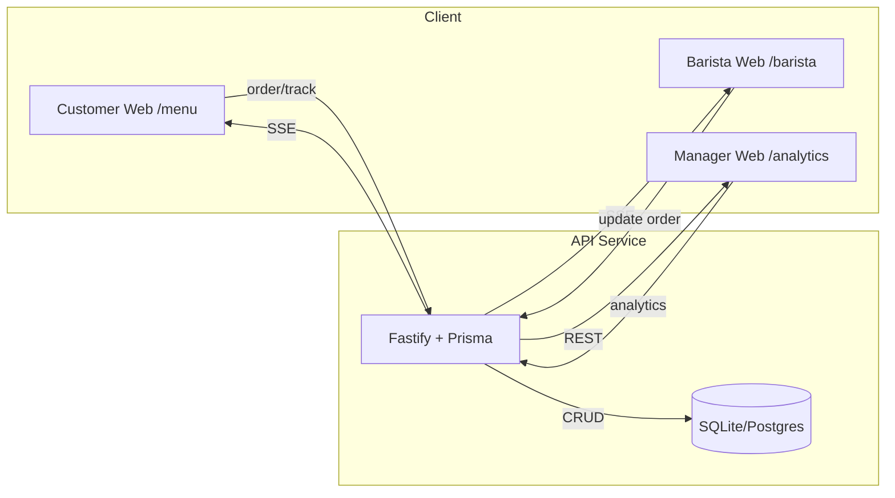

# Smart Café ☕

ระบบตัวอย่างบริหารร้านกาแฟ  
(ลูกค้า → ตะกร้า → QR → ติดตาม | บาริสต้า Queue | ผู้จัดการ Analytics)

---

## 🚀 Tech Stack
- **Frontend**: Next.js 15 (App Router), React Query, Zustand, Recharts  
- **Backend**: Fastify, Prisma, SQLite (dev)  
- **Test**: Vitest, Playwright, axe-core (a11y), Lighthouse CI  
- **CI/CD**: GitHub Actions  

---

## 📦 Getting Started
```bash
pnpm install
pnpm dev:both   # run api (4000) + web (3000)
```

## 🌐 เปิดใช้งาน
- **Customer** → http://localhost:3000/menu
- **Barista** → http://localhost:3000/barista
- **Manager** → http://localhost:3000/analytics
- **API Docs** → http://localhost:4000/api/docs

---

## 🗄️Database
```bash
pnpm  --filter  api  run  prisma:generate
pnpm  --filter  api  run  prisma:migrate  dev
pnpm  --filter  api  run  prisma:seed
```

---

## 🧪 Test
```bash
pnpm  test  # unit
pnpm  e2e  # e2e (ต้อง run dev:both ก่อน)
pnpm  a11y  # accessibility
```

---

## 🚢 Deployment
```bash
Build:  pnpm  build
Start API:  pnpm  --filter  api  start
Start Web:  pnpm  --filter  web  start
```

---

## 🎬 Demo Guide (สำหรับทีม/สาธิต)
เปิด **2 browser window**

**Window A: ลูกค้า**
1.  เข้า `/menu` → เพิ่มลงตะกร้า → ชำระ → ดู QR → ติดตามสถานะ
   
**Window B: บาริสต้า**
1.  เข้า `/staff/barista` → เห็น order เด้งมา real-time → กด _ทำเสร็จแล้ว_
    
**กลับไปที่ลูกค้า**
-   สถานะเปลี่ยนเป็น **พร้อมรับแล้ว** ✅
    
**เปิด /analytics**
-   เห็นยอดขาย, เมนู top, ชั่วโมงพีค

---

## 📊 Diagram



---

## 📜 License

MIT
